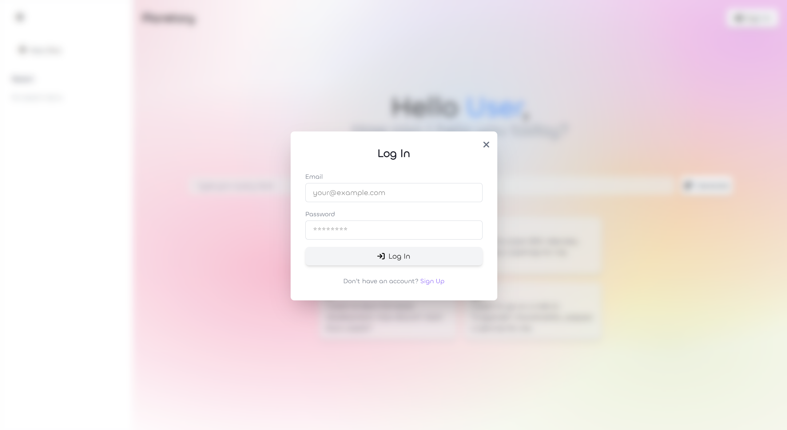
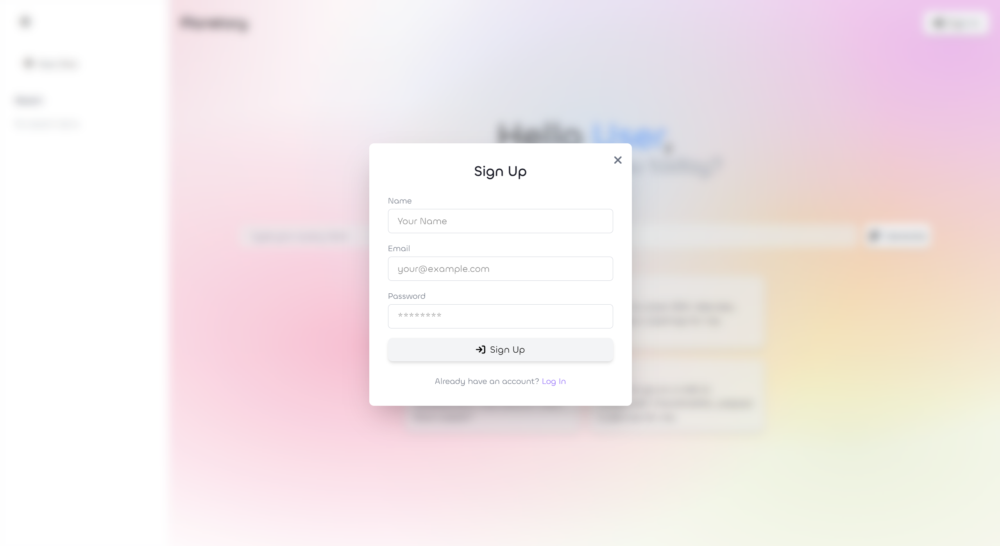
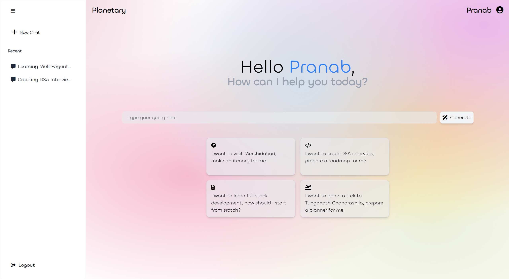
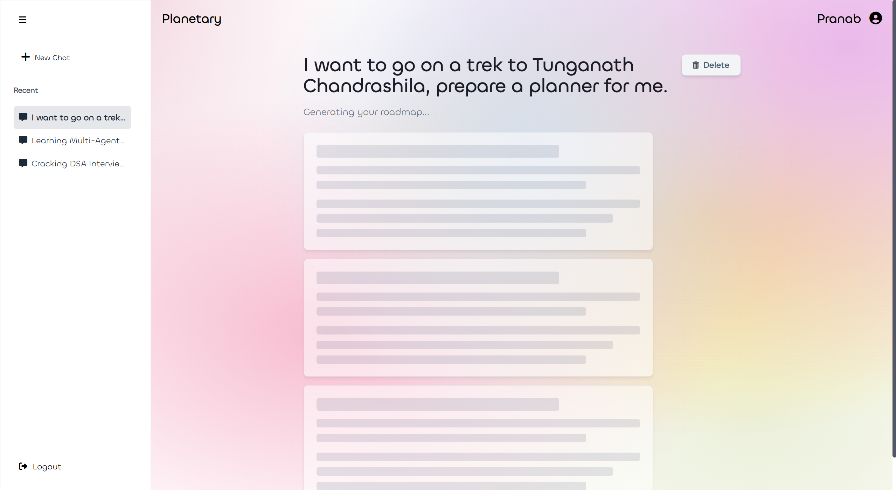
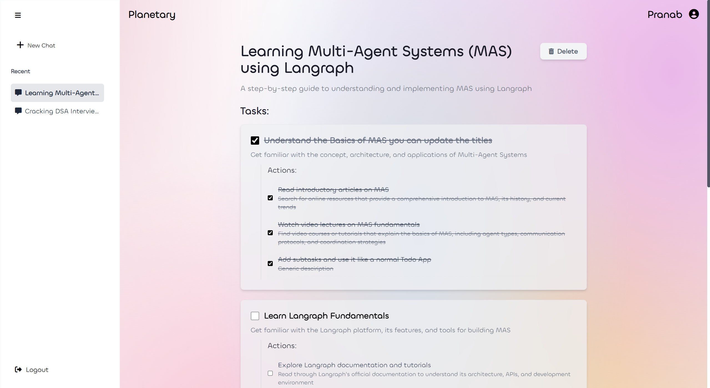
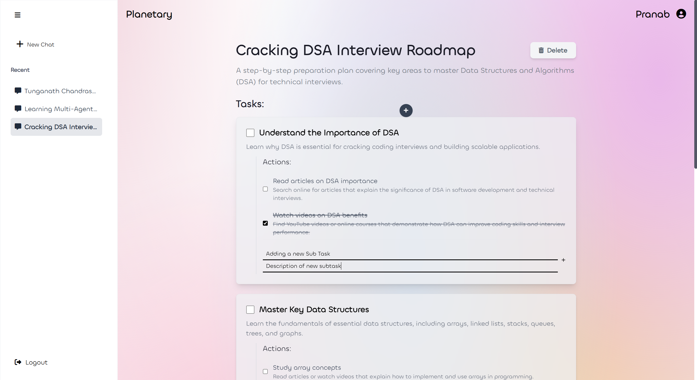

# Planetary
Your AI powered roadmap generator.

## Screenshots

Here are some screenshots showcasing the application's key features and user flow:

<div style="display: flex; justify-content: space-around; align-items: flex-start;">
  
  
</div>

<div style="display: flex; justify-content: space-around; align-items: flex-start;">
  
  
</div>

<div style="display: flex; justify-content: space-around; align-items: flex-start;">
  
  
 
</div>

## Features

- [x] **Authentication:** Secure user login and registration.
- [x] **MongoDB Integration:** Persistent storage for user data and generated roadmaps.
- [x] **AI-Powered Generation:** Generate comprehensive roadmaps by providing a simple query.
- [x] **Optimistic UI Updates:** Seamless user experience with immediate UI feedback during roadmap generation.
- [x] **Editable Content:** Customize generated task titles and subtasks to fit your needs.
- [x] **Task Management:** Functionality to use the application as a personal Todo App by adding custom Task Cards.

## Getting Started

*(Add your detailed setup instructions here. Example sections below)*

### Prerequisites

* Node.js (v18 or higher)
* npm or Yarn
* Python (3.10 or higher)
* pip
* Docker Desktop (for MongoDB, Backend, and Langgraph services)
* Ollama (if you are running the Langgraph service locally and connecting to your host's Ollama instance)
* If you want to use Gemini, change the model in Agent.py in Planetary_langgraph_service
---
### Installation

1.  **Clone the repository:**
    ```bash
    git clone [https://github.com/Pranab1109/Planetary.git](https://github.com/Pranab1109/Planetary.git)
    cd Planetary
    ```
2.  **Backend Setup (`Planetary_backend`):**
    ```bash
    cd Planetary_backend
    npm install
    ```
    Create a `.env` file in `Planetary_backend/` with the following variables:
    ```env
    MONGO_URI=mongodb://mongodb:27017/planetary_roadmap
    FRONTEND_ORIGIN=http://localhost
    JWT_SECRET=<Create a JWT Secret>
    LANGGRAPH_SERVICE_INTERNAL_URL=http://langgraph_service:8003
    ```
    (Note: If you plan to use Docker Compose for the backend, some of these might be set in `docker-compose.yml`)

3.  **Langgraph Service Setup (`Planetary_langgraph_service`):**
    ```bash
    cd ../Planetary_langgraph_service
    pip install -r requirements.txt
    ```
    You might need to create a `.env` file here if your Python service uses environment variables for things like Ollama host or API keys.

4.  **Frontend Setup (`Planetary_frontend`):**
    ```bash
    cd ../Planetary_frontend
    npm install
    ```
    Create a `.env` file in `Planetary_frontend/` with the following variable (for `npm run dev`):
    ```env
    VITE_BACKEND_URL=http://localhost:5000
    ```
---
### Running the Application

1.  **Start Docker Compose services (MongoDB, Backend, Langgraph):**
    From the root `Planetary/` directory:
    ```bash
    docker-compose up --build -d
    ```
    This will build and start your database, backend, and Langgraph services in the background.

2.  **Start the Frontend Development Server:**
    From the `Planetary_frontend/` directory:
    ```bash
    cd Planetary_frontend
    npm run dev
    ```
    This will start the frontend development server, typically accessible at `http://localhost:5173` (or another port specified by Vite).

3.  **Access the Application:**
    Open your web browser and navigate to the URL provided by the `npm run dev` command (e.g., `http://localhost:5173`).

---